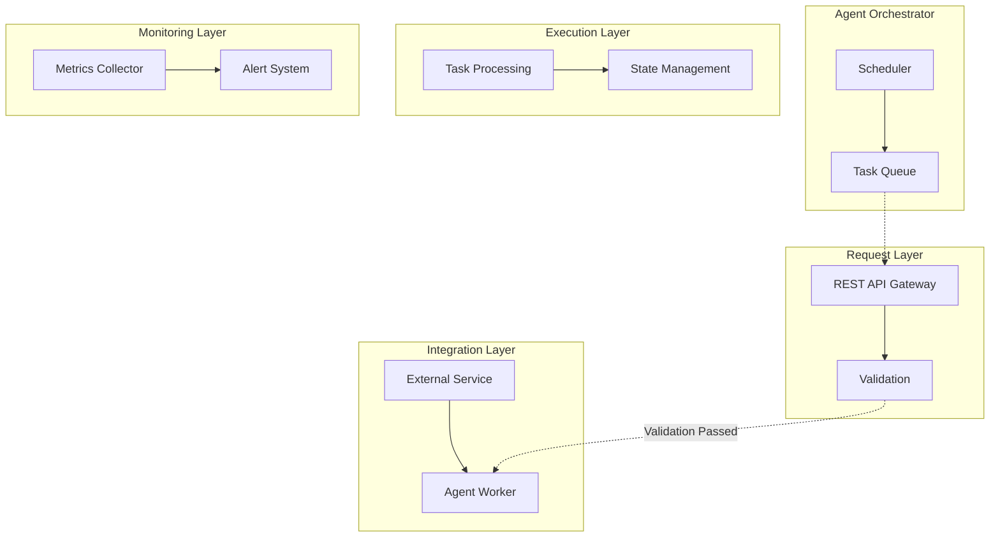

# Agent AI Platform

## Overview
A plataforma central para desenvolvimento e gerenciamento de agentes inteligentes, baseada em arquiteturas modernas e padrões de software distribuído. Esta ferramenta fornece ferramentas completas para criação, integração e monitoramento de agentes autônomos.

## 🏗️ Architecture

### Componentes Principais

```
┌─────────────────────────────────────────────────────────────────┐
│                        AGENT-AI ARCHITECTURE                      │
├─────────────────────────────────────────────────────────────────┤
│  ┌──────────────┐    ┌──────────────┐    ┌──────────────────┐   │
│  │   Orchestrator │ →  │  Request     │ →  │  Response      │   │
│  │  (Scheduler)   │◄───►│  Handler     │◄───┘                   │
│  └──────────────┘    └──────────────┘           └──────────────────┘   │
│                                      ↑                                    │
│                                      |                                    │
│                                      | REST API Gateway                       │
│                                      ▼                                    │
│                    ┌───────────────────────────────────────────────────┐  │
│                    │         Request Routing Layer                     │  │
│                    │   - Route Matching (URL, Method, Headers)           │  │
│                    │   - Load Balancing (Multiple Agents per Endpoint)    │  │
│                    │   - Rate Limiting & Caching                         │  │
│                    └───────────────┬──────────────────────────────────┘  │
│                                      │                                    │
│                    ┌───────────────▼───────────────┐                       │
│                    │         Validation Layer          │                       │
│                    │   - Schema Validation             │                       │
│                    │   - Security Checks                 │                       │
│                    └───────────────┬───────────────┘                       │
│                                      ▼                                    │
│        ┌──────────────────────────────────────────────────┐               │
│        │           Agentic Workflow Layer                  │               │
│        │  ┌───────────────┐    ┌───────────────┐          │               │
│        │  │ Task Queue      │◄───►│   Agent     │          │               │
│        │  │ (Redis Cluster) │    │ Worker      │          │               │
│        │  └───────────────┘    └───────────────┘          │               │
│        │                                                    │               │
│        │   ┌──────────────────────────────────────────────┐ │               │
│        │   │         Integration Layer                     │ │               │
│        │   │  - API Gateway (Stripe, AWS, Slack, etc)       │ │               │
│        │   │  - External Service Calls                      │ │               │
│        │   │  - Authentication (OAuth2, JWT)                 │ │               │
│        │   └───────────────┬────────────────────────────────┘ │               │
│        │                    ▼                                    │               │
│        │           ┌──────────────────────────────────────────────┐ │               │
│        │           │         Agent Execution                     │ │               │
│        │           │  - Task Processing                           │ │               │
│        │           │  - State Management                          │ │               │
│        │           │  - Error Handling                              │ │               │
│        │           └───────────────┬────────────────────────────┘ │               │
│        │                    ▲                                    │               │
│        │   ┌──────────────────────────────────────────────────┐  │               │
│        │   │         Monitoring Layer                          │  │               │
│        │   │   - Performance Metrics (Latency, Throughput)     │  │               │
│        │   │   - Resource Usage (CPU, Memory, Network)           │  │               │
│        │   │   - Agent Health Checks                             │  │               │
│        │   └──────────────────────────────────────────────────┘  │               │
│        └──────────────────────────────────────────────────────────┘  │
└─────────────────────────────────────────────────────────────────────┘
```

### Agent Architecture Diagram



## 📦 Key Features

- **Multi-Agent Scheduling**: Gerenciamento de múltiplos agentes com priorização baseada em contexto
- **Integration Hub**: Conectividade com APIs externas (Stripe, AWS, Slack, etc.)
- **State Management**: Persistência de estado entre execuções
- **Monitoring Dashboard**: Visualização em tempo real de performance e recursos
- **Security Framework**: Autenticação JWT e validação de schemas

## 🛠️ Technology Stack

- **Orchestration**: Celery + Redis
- **Communication**: REST API, GraphQL
- **State Persistence**: PostgreSQL + Redis
- **Monitoring**: Prometheus + Grafana
- **Authentication**: OAuth2 & JWT

## 📚 Documentation

- [API Reference](./api.md)
- [Agent Development Guide](./dev-guide.md)
- [Architecture Documentation](./architecture.md)

---
*Last Updated: June 2024*